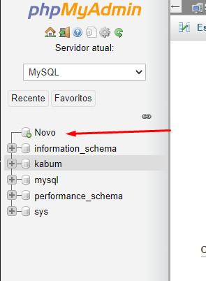
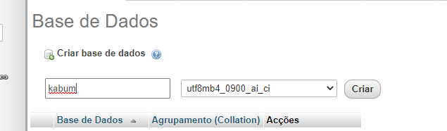
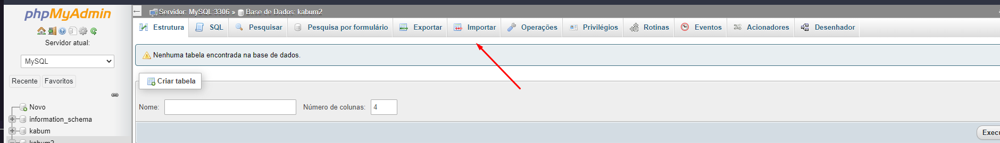
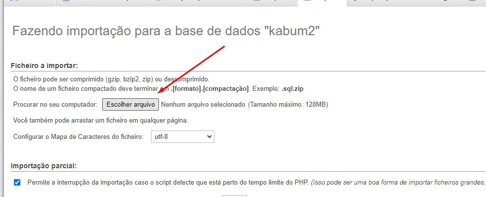
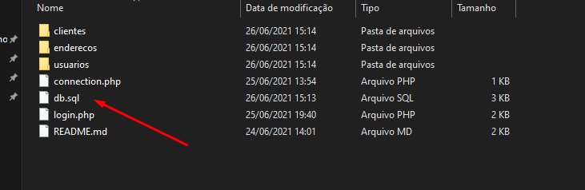
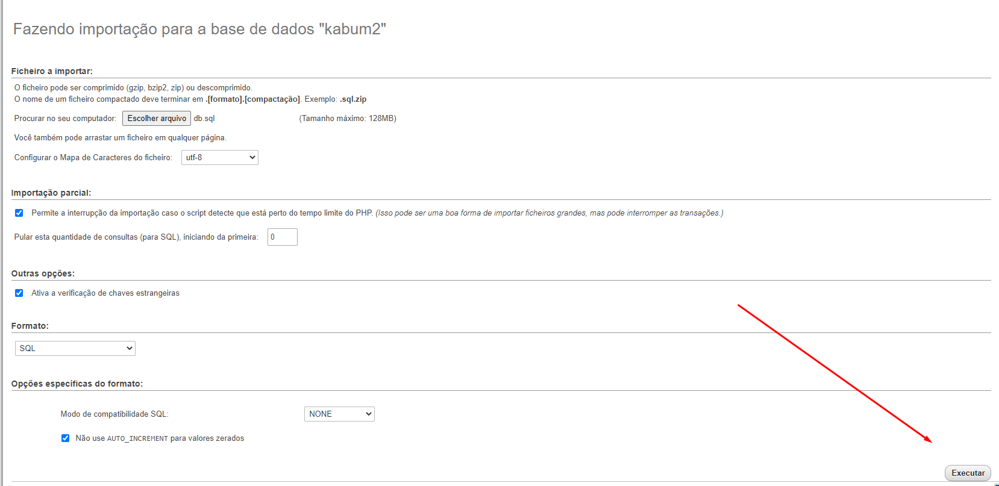

<br />
<h3 align="center" >KaBuM! - Teste</h3>
<p align="center" >Processo Seletivo - Fullstack</p>
<hr />

### :weight_lifting_man: Desafios:
 
  Entidades:
  
    Cliente:
      [] Cadastro;
      [] Visualização;
      [] Edição;
      [] Eclusão;
      [] Endereco (1 - N);
    
    Usuário:
      [] Cadastro;
      [] Visualização;
      [] Edição;
      [] Eclusão;
      
    Endereco: 
      [] Cadastro;
      [] Visualização;
      [] Edição;
      [] Eclusão;
      
  Funcionalidades:
  
    [] Login;
    [] Operaçoes de CRUD;
    
<hr />

<h3>Iniciar o Projeto: </h3>

  <p>1 - Primeiro deve ser feita a instalação de um servidor PHP local, como por exemplo o WampServer ou Xampp, para baixar um dos dois, basta clicar em Download no link abaixo: <br/>  https://sourceforge.net/projects/wampserver/ <br/> https://www.apachefriends.org/pt_br/index.html </p>
  <p>2 - Tendo feito o download do WampServer, basta seguir a instalação e marcar para instalar o banco de dados MySQL na versão 8.0, deixe a porta do MySQL por padrão na 3306. No caso do Xampp, basta seguir com a instalação.</p>
  <p>3 - Execute o WampServer/Xampp e seus serviços</p>
    <p>4 - Agora basta fazer o clone desse repositório em ~\wamp64\www (Wamp) ou ~\xampp\htdocs (Xampp), provavelmente eles estarão na raiz do C:/ </p>
  
  ```bash
git clone https://github.com/FischerRobson/kabum-api.git
```
  <p>5 - Após isso, será necessário rodar o comando para criar o banco de dados no seu computador, para isso: </p>
  <ul>
    <li>Abra seu navegador</li>
    <li>Acesse: <a href="http://localhost/phpmyadmin">localhost/phpmyadmin</a></li>
    <li>Faça login com o usuário "root" e a senha deixe em branco: <br />
      
    </li>
    <li>Clique para criar um novo banco de dados<br/>
        
    </li>
    <li>Crie o novo banco com o nome: kabum<br/>
        
    </li>
    <li>Faça a importação do arquivo db.sql (Wamp) ou do db_xampp.sql (Xampp) dentro do banco, para isso clique no banco kabum e escolha a opção importar<br/>
        
    </li>
    <li>Clique na opção Escolher arquivo<br/>
        
    </li>
    <li>Selecione o arquivo db.sql caso esteja utilizando o Wamp, ou o arquivo db_xampp.sql no caso do Xampp<br/>
        
    </li>
    <li>Clique em executar para finalizar a importação<br/>
        
    </li>
  </ul>
<p>6 - Após finalziar a criação do banco de dados, basta seguir e clonar o repositório do <a href="https://github.com/FischerRobson/kabum-desafio">front-end</a> </p>
